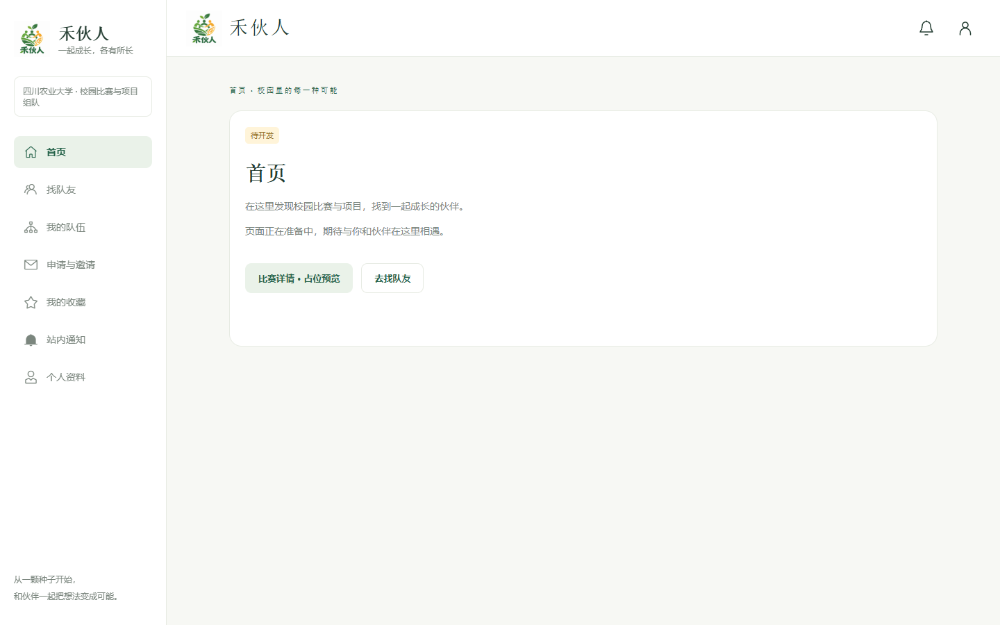
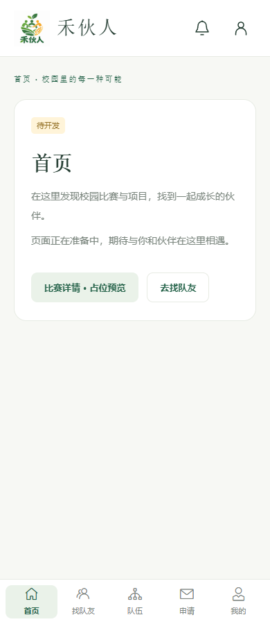
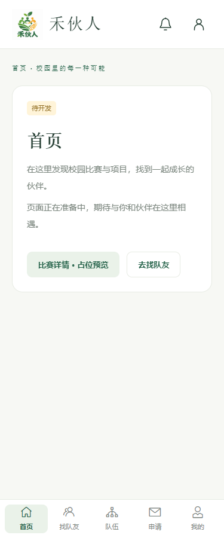

# Issue #7 验收记录

验收日期：2026 年 10 月 2 日。范围：[学生端路由与待开发占位页](https://github.com/jingtll/HeHuoRen/issues/7)。

## 实现与边界

- 默认入口进入 `/home`，首页内部嵌套比赛详情 `/home/competitions/:id`。
- 共享桌面侧栏与移动底部导航；详情、发布招募、收藏、通知与账号占位均提供真实路由入口。
- 业务页直接开放，只展示标题、待开发说明与导航；无认证状态、权限守卫、模拟数据和业务操作。
- 未知地址显示独立 404；`/health` 保留现有独立检查、刷新与重试。
- README 与开发计划书同步实际页面清单与当前进度。既有领域术语没有发生变化，本次无新增术语或需记录的架构权衡，因此未修改 CONTEXT 或新增 ADR。
- Vue 文件中的 TypeScript 类型导入暴露了既有 ESLint 脚本解析配置缺口，已为 Vue 脚本配置 TypeScript 解析器。

## 自动检查

以下检查在本机通过：

- `pnpm format:check`
- `pnpm --filter @hehuoren/web lint`
- `pnpm --filter @hehuoren/web typecheck`
- `pnpm --filter @hehuoren/web build`
- `pnpm --filter @hehuoren/web test:unit`：2 个文件、27 项测试通过，包含现有健康状态测试与新增路由/组件测试。

路由测试覆盖默认入口、全部占位页直接访问、标题、首页内部详情与返回、静态发布路径和动态详情区分、导航归属、个人资料入口、原比赛路径与未知路径 404，以及健康页失败后重试和刷新。上述页面不依赖业务接口。

## 浏览器验收

使用隔离无头 Edge 与 Playwright，访问 Vite 的生产构建预览（`127.0.0.1:4173`），验证了：

- 375px、390px、1440px 三个视口，对 13 个地址共进行 39 次直接访问；标题与占位状态正确，无横向溢出、无底部导航遮挡正文。
- 动态路径与 query 正常匹配；`/teams/new` 为发布招募页。
- 桌面七个主导航与移动五个底部导航正常跳转；当前栏目正确高亮。
- 首页比赛详情保留嵌套内容区域，直接刷新后正常显示，浏览器前进/后退及返回首页正常。
- 发布招募刷新正常；队伍详情预览、收藏、通知、登录、注册均可通过入口进入。
- Tab 可聚焦“跳到正文”，3px 焦点轮廓可见；Enter 将焦点移至正文。
- 健康页首次失败、重试成功、刷新成功，共三次请求；页面不包含学生导航。
- 页面无未捕获 JavaScript 错误。

健康接口的浏览器验证使用明确的本地响应桩（首次 503，随后返回 `browser-check-2` / `browser-check-3`），只证明健康页交互保持正常，不证明真实 API 或数据库联通。未扩展生产部署；History 路由部署时需配置 SPA fallback。远端 CI 以关联 PR 的实际检查结果为准。

## 顶栏与项目 Logo 更新

根据用户参考图，顶栏采用白色背景、左侧项目 Logo 与“禾伙人”、右侧线条通知和个人资料图标；不显示“学生端 DEMO”。通知和个人资料图标分别跳转到现有占位页。项目 Logo 使用用户提供的原图，保存于 `apps/web/src/assets/hehuoren-logo.png`，经 `ProjectLogo.vue` 在顶栏、侧栏、轻量品牌布局和健康页复用。

更新后再次通过 Web Lint、27 项测试、类型检查与构建，并完成三个目标视口的既有浏览器验收；补充确认 Logo 图片加载正常、顶栏图标入口正常及品牌入口返回首页。原图未修改。

## 截图

1440px 首页：

390px 首页：

375px 首页：

