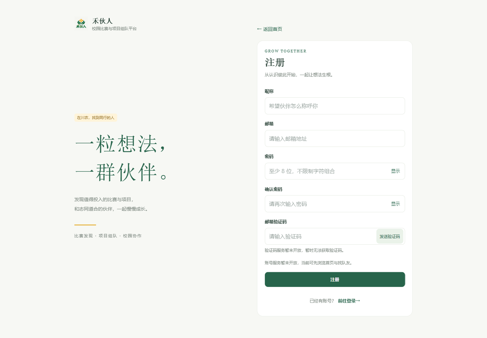
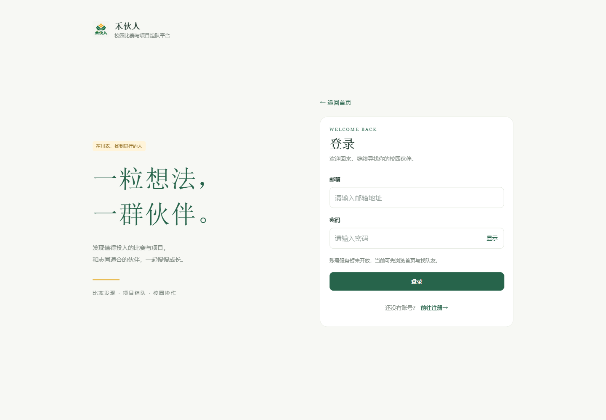
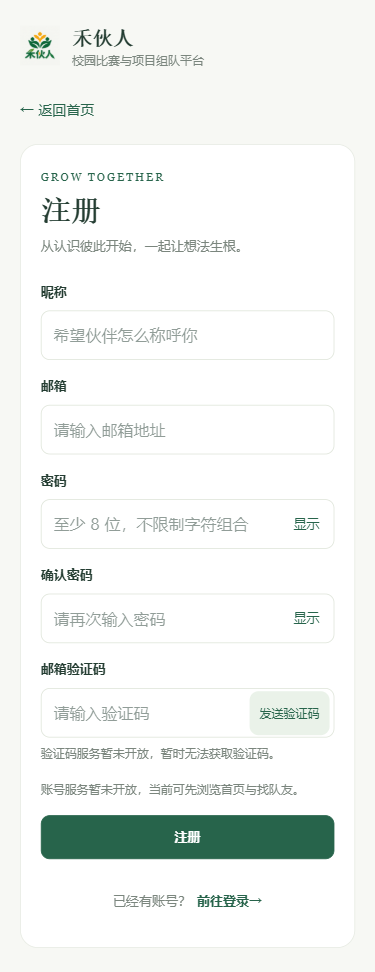
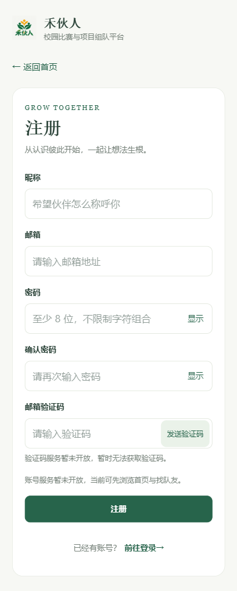
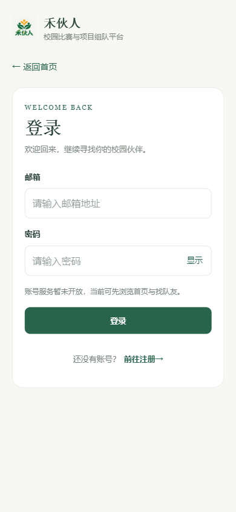

# Issue #9：登录注册前端验收

日期：2026-10-02。需求来源：[Issue #9](https://github.com/jingtll/HeHuoRen/issues/9)。

## 交付与接口现状

`/login` 与 `/register` 已替换占位页，复用 `BrandLayout.vue`、`ProjectLogo.vue`、共享主题变量和 Vant 按钮。桌面为品牌区与表单，移动端为单列表单，无业务侧栏或底部导航。404 保留原有独立页面。

登录包含邮箱与密码；注册包含昵称、邮箱、密码、确认密码、邮箱验证码。必填、昵称非纯空白、邮箱格式、注册密码至少 8 位及确认密码一致性均有错误反馈。登录只校验密码非空，密码保留原始空格与字符；验证码只校验必填，不固定长度、字符格式或发送间隔。

核查 `apps/api/src/app.module.ts`、现有 Controller 与 `apps/api/openapi.json`：仅有健康接口，没有认证或邮件验证码 API。计划书中的 `/auth/*` 路径属于后续设计，当前不能联调。校验通过后提交提示“认证服务暂未开放”；发送验证码先校验邮箱，然后提示“验证码服务暂未开放”。不发出认证请求，不模拟发送成功、倒计时、Session 或认证跳转，不持久化敏感输入。切换登录注册页时销毁表单状态。

邮箱验证码为本次新增的产品要求，已同步计划书；真实认证、邮件发送与校验、有效期、重发限频仍需后续实现与真实 OpenAPI 契约。没有使用测试桩宣称接口可用，本次未新增后端任务。

## 自动化检查

以下为本次工作区的实际检查；远端 CI 单独以 PR 记录为准。

| 检查                                    | 结果                          |
| --------------------------------------- | ----------------------------- |
| `pnpm format:check`                     | 通过                          |
| `pnpm --filter @hehuoren/web lint`      | 通过                          |
| `pnpm --filter @hehuoren/web typecheck` | 通过                          |
| `pnpm --filter @hehuoren/web build`     | 通过，生产产物用于浏览器检查  |
| `pnpm --filter @hehuoren/web test:unit` | 通过，3 个测试文件、39 项测试 |

表单测试覆盖注册五项必填、纯空白昵称、邮箱格式、7 位密码、确认密码不一致、空白验证码、错误修复、修改密码后重新核对确认密码、短密码登录、密码原始空格、独立显示隐藏、按钮不提交、邮箱前置校验、服务未开放反馈、修改邮箱清除反馈、无网络请求及无存储写入。路由测试覆盖真实表单、标题、品牌布局、互切清空密码、历史前进后退和返回首页；原有健康页与学生端路由回归测试仍通过。

## 浏览器与布局

检查本地生产构建预览 `http://127.0.0.1:4173`，使用独立浏览器上下文，未启动后端或使用认证响应桩。视口由设备仿真明确设置，读取 `innerWidth` 与文档 `scrollWidth` 核对。

| 页面 | 375px       | 390px       | 1440px        |
| ---- | ----------- | ----------- | ------------- |
| 注册 | `375 / 375` | `390 / 390` | `1440 / 1440` |
| 登录 | `375 / 375` | `390 / 390` | `1440 / 1440` |

表中为“视口宽度 / 文档宽度”，均无横向溢出。移动注册页文档高度 972px，允许正常纵向滚动，提交与切换入口没有固定导航遮挡；桌面显示品牌说明，移动端隐藏说明。截图均为空表单，不含密码或验证码。

浏览器实际操作确认：

- 注册空表单显示五项错误，聚焦昵称；可访问性树包含必填、无效状态及关联错误描述。
- 输入有效注册字段后，发送验证码显示服务未开放，提交显示认证服务未开放；无成功状态、无倒计时、无 `/api/` 请求。
- 密码显示切换可用，包含首尾空格的密码保持原样。
- 登录使用单字符密码并按 Enter 可触发提交，反馈服务未开放。
- 使用 Tab 到页面切换链接时，主题焦点轮廓清晰可见。
- 两页直接访问、刷新、互切、返回首页和浏览器前进后退保持正确标题与内容；刷新不恢复密码，未创建 localStorage 或 sessionStorage 数据。

### 桌面

### 手机

## 未验证范围

真实注册、登录、邮件投递与验证码校验尚未实现，无法验证请求加载、限频、重发、网络错误恢复或成功会话。本次前端完成不代表阶段二账号闭环完成；数据库、Session/CSRF、资料、学校统一认证及找回密码仍不在本次范围。
