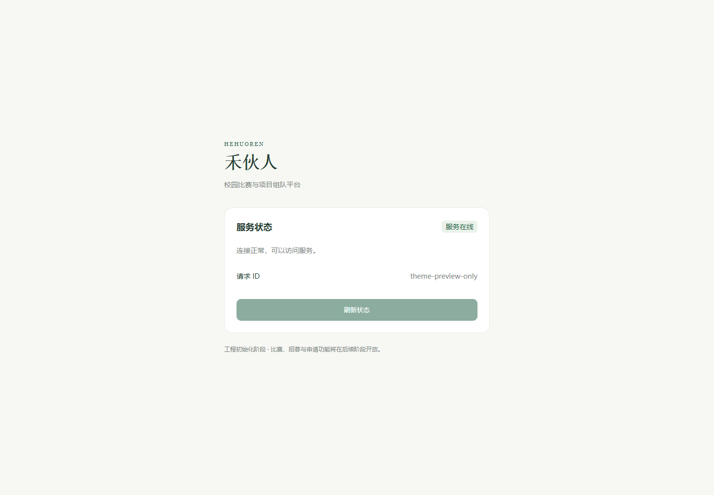
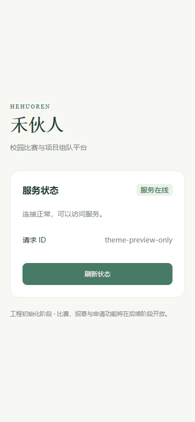

# 学生端全局样式

2026-10-02 选定的视觉基准为[第一版学生端 Demo](demos/hehuoren-student-demo.html#competitions)。后续学生页面沿用该版本的暖白背景、禾苗绿主色、谷物黄点缀与轻量圆角卡片。

## 样式入口

全局样式位于 [apps/web/src/style.css](../apps/web/src/style.css)，由 main.ts 加载，仅导入 Tailwind，层级为 `theme → base → components → utilities`。采用 Tailwind 为主 + 少量普通 CSS + 按需封装组件；保留 `--hhr-*` 主题变量与语义工具类。页面布局、间距、排版、尺寸和常见状态优先用工具类，普通 CSS 用于基础主题、复合输入行、复杂效果及确有必要的响应式适配。

| 用途               | 变量 / 颜色                           | Tailwind 用法            |
| ------------------ | ------------------------------------- | ------------------------ |
| 主要操作与品牌     | `--hhr-color-brand` / `#27644b`       | `text-brand`、`bg-brand` |
| 主要操作悬停       | `--hhr-color-brand-hover` / `#183e30` | `hover:bg-brand-hover`   |
| 浅绿状态与轻量操作 | `--hhr-color-brand-soft` / `#eaf2e9`  | `bg-brand-soft`          |
| 正文               | `--hhr-color-ink` / `#243d32`         | `text-ink`               |
| 辅助文字           | `--hhr-color-muted` / `#7b867e`       | `text-muted`             |
| 页面背景           | `--hhr-color-page` / `#f7f8f4`        | `bg-page`                |
| 卡片与表单背景     | `--hhr-color-surface` / `#fff`        | `bg-surface`             |
| 边框与分隔线       | `--hhr-color-line` / `#e7ebe3`        | `border-line`            |
| 提醒点缀           | `--hhr-color-accent` / `#e9bd56`      | `bg-accent`              |
| 提醒浅底           | `--hhr-color-accent-soft` / `#fff4d9` | `bg-accent-soft`         |
| 错误与危险操作     | `--hhr-color-danger` / `#b85a49`      | `text-danger`            |

正文使用中文无衬线字体，主题与品牌文案按需使用 `font-serif`；字体采用本地回退。圆角为控件 9px、卡片 15px、面板 18px，对应 `rounded-control`、`rounded-card`、`rounded-panel`。页面布局继续用 Tailwind，通常使用 8 / 12 / 18 / 24px 的间距。

## 共用组件样式

- `hhr-panel`：带边框、白底与 18px 圆角的内容面板。
- `hhr-card`：15px 圆角的比赛或招募卡片容器。
- `hhr-eyebrow`：小字号英文引导文字。
- `hhr-button`：主要按钮；附加 `hhr-button--secondary`、`hhr-button--soft`、`hhr-button--danger` 切换次要、轻量或危险样式。
- `hhr-badge`：状态标签；附加 `hhr-badge--warning`、`hhr-badge--muted`、`hhr-badge--danger` 表示提醒、弱化或危险状态。
- `hhr-input`：原生表单控件外观，复用现有 AuthInput 与 CollegePicker。

按实际复用和行为封装组件，不为旧组件机械建立同名替代品。主要操作按钮用原生 button 与 hhr-button；输入行内的密码显隐使用 auth-reveal 与局部样式，保留44px高度、共享主题和焦点，不附加主要操作背景；健康请求 ID 用 dl/dt/dd，长文本可任意换行；加载指示复用 LoadingIndicator。尺寸与布局由 Tailwind 工具类调整，避免页面重复硬编码品牌色。状态同时显示文字；按钮保留键盘焦点提示和禁用反馈，尊重减少动态效果的系统设置。

当前健康页已接入共享主题。第一版 Demo 中的侧栏、底部导航、比赛封面与插画属于页面结构和素材，后续实现相应页面时按视觉基准使用。

## 项目 Logo 与顶栏

项目 Logo 使用用户提供的品牌图，资源为 `apps/web/src/assets/hehuoren-logo.png`，通过 `ProjectLogo.vue` 复用；图片与品牌名称一起展示时使用空替代文本，避免屏幕阅读器重复朗读。

学生端顶栏采用白底、左侧 Logo 与“禾伙人”、右侧通知及个人资料线条图标，不显示“学生端 DEMO”。图标入口保留可访问名称、44px 点击区域和主题焦点轮廓；链接到对应路由占位页。登录与注册仍可通过个人资料页进入。

## 主题预览

以下截图属于移除 Vant 前的历史前端构建产物，桌面宽度为 1440px、手机宽度为 390px。健康响应使用本地预览桩（`theme-preview-only`），截图仅展示样式，不证明真实 API 或数据库状态。

## 图标与交互约定

导航与顶栏通过 `AppIcon.vue` 使用 Lucide `@lucide/vue` 1.51.0：仅在 `app-icons.ts` 静态导入 House、Users、Network、Mail、Star、Bell、UserRound，使用业务名称映射，不加载全集。来源为 [Lucide 官方 Vue 文档](https://lucide.dev/guide/vue)，ISC 许可证；包中部分 Feather 派生图标另含 MIT 声明，完整通知随仓库保留于 [third-party-notices/lucide-LICENSE.txt](../third-party-notices/lucide-LICENSE.txt)。

AppIcon 均为装饰图标，隐藏于辅助技术且不可聚焦，名称由可见文字或链接 aria-label 提供。按钮明确原生 type：密码显隐、验证码、健康刷新为 button，登录/注册为 submit。密码按钮高度44px，提交与刷新按钮最小高度44px；禁用反馈与加载文字同时存在，LoadingIndicator 尊重减少动态效果设置。

当前库渲染 Web SVG，在 uni-app H5 可作为待验证的 Web 方案；微信小程序不能据此宣称兼容，需在统一入口替换为 image 与适合目标端的资源。官方 image 说明指出小程序 SVG 仅支持网络地址，迁移优先考虑本地 PNG，重新处理 currentColor、多主题颜色和尺寸。依据与集中待办见[迁移提醒约定](agents/uni-app-migration.md)。

## 验收记录适用时期

上述主题截图及 Issue #7/#9/#17 记录保留历史事实；移除 Vant 后的浏览器检查与新截图以[Issue #19 验收记录](issue-19-validation.md)为准。
